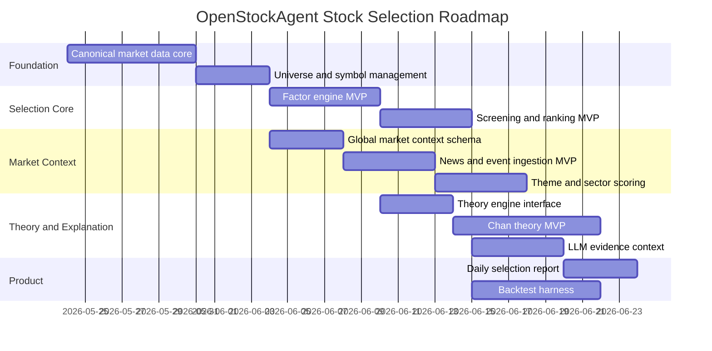

# Global-Aware Stock Selection Implementation Plan

> **For agentic workers:** REQUIRED SUB-SKILL: Use superpowers:subagent-driven-development (recommended) or superpowers:executing-plans to implement this plan task-by-task. Steps use checkbox (`- [ ]`) syntax for tracking.

**Goal:** Reorient OpenStockAgent from single-stock prediction into a global-aware quantitative stock selection research agent.

**Architecture:** The system builds a canonical data core, computes stock-level factors and theory structures, adds top-down market context from global assets and news events, ranks a universe of stocks, and generates evidence-grounded explanations. Kronos becomes an optional factor source rather than the center of the product.

**Tech Stack:** Python 3.13, pandas, sqlite3, pytest, click, optional Kronos adapter, future LLM provider integration.

---

## Strategic Roadmap

This roadmap supersedes the old "prediction-first" product direction. The existing market data source plan is retained as Phase 1 because canonical data remains the foundation.



## Phase 0: Product Reframing

**Purpose:** Make the repository language match the actual goal: stock selection, not single-stock price prediction.

**Files:**
- Modify: `README.md`
- Modify: `参考方案.md`
- Keep: `docs/superpowers/specs/2026-05-24-global-aware-stock-selection-architecture.md`

**Tasks:**

- [ ] Update README title and description to "Global-aware quantitative stock selection research agent".
- [ ] Move Kronos wording from primary mission to optional factor source.
- [ ] Add a short architecture summary:

```text
Universe -> Data -> Factors -> Market Context -> Ranking -> Evidence -> LLM Explanation
```

**Acceptance criteria:**

- README no longer describes the project mainly as a Kronos prediction tool.
- The old `scripts/run_prediction.py` can remain, but it is described as an experimental utility.

## Phase 1: Canonical Data Core

**Purpose:** Implement the first part of the existing market data plan.

**Source plan:** [2026-05-23-market-data-source-implementation.md](/Users/zhangtianwei/IT/openstockagent/docs/superpowers/plans/2026-05-23-market-data-source-implementation.md)

**Deliverables:**

- `instruments`
- `instrument_aliases`
- `bars`
- `feed_runs`
- `data_quality_issues`
- `prediction_runs`
- `predicted_bars`
- `CsvFeed`
- migrated `YahooFinanceFeed.fetch_bars`
- `FeedRegistry`
- `load_kronos_frame`

**Acceptance criteria:**

- Default tests do not require network access.
- Canonical `bars` support `instrument_id`, `interval`, `source`, `adjustment`, and `timestamp`.
- Kronos can read a canonical frame but does not own the data flow.

## Phase 2: Universe Management

**Purpose:** Define which stocks can be selected.

**New files:**

```text
src/openstockagent/universe/
  __init__.py
  models.py
  storage.py
  builders.py

tests/test_universe.py
```

**Tables:**

```text
universes
  universe_id TEXT PRIMARY KEY
  name TEXT NOT NULL
  market TEXT NOT NULL
  asset_type TEXT NOT NULL
  description TEXT
  created_at TEXT NOT NULL

universe_members
  universe_id TEXT NOT NULL
  instrument_id TEXT NOT NULL
  start_date TEXT NOT NULL
  end_date TEXT
  reason TEXT
  UNIQUE(universe_id, instrument_id, start_date)
```

**Tasks:**

- [ ] Add dataclasses `Universe` and `UniverseMember`.
- [ ] Add storage methods `upsert_universe`, `upsert_universe_members`, and `load_universe_members`.
- [ ] Add CSV builder for a deterministic test universe.
- [ ] Add one fixture universe: `tests/fixtures/cn_sample_universe.csv`.

**Acceptance criteria:**

- A screen run can request a universe by `universe_id`.
- Universe membership is time-aware through `start_date` and `end_date`.

## Phase 3: Factor Engine MVP

**Purpose:** Compute cross-sectional stock selection evidence.

**New files:**

```text
src/openstockagent/factors/
  __init__.py
  definitions.py
  technical.py
  cross_section.py
  storage.py

tests/test_factor_engine.py
```

**Tables:**

```text
factor_definitions
  factor_name TEXT PRIMARY KEY
  category TEXT NOT NULL
  direction TEXT NOT NULL
  description TEXT NOT NULL
  version TEXT NOT NULL

factor_values
  instrument_id TEXT NOT NULL
  trade_date TEXT NOT NULL
  interval TEXT NOT NULL
  factor_name TEXT NOT NULL
  factor_value REAL
  percentile REAL
  zscore REAL
  version TEXT NOT NULL
  evidence_json TEXT
  UNIQUE(instrument_id, trade_date, interval, factor_name, version)
```

**Initial factors:**

```text
return_5d
return_20d
return_60d
ma_trend_score
ma_slope_20d
volume_expansion_20d
atr_14d
max_drawdown_20d
turnover_amount_20d
```

**Tasks:**

- [ ] Define factor metadata and scoring direction.
- [ ] Compute per-stock factors from canonical bars.
- [ ] Compute universe percentile and z-score per factor.
- [ ] Store factor values with evidence JSON.

**Acceptance criteria:**

- Given a small fixture universe, the engine computes deterministic factor values.
- Each factor has category, version, and direction.
- No factor uses future bars beyond `as_of`.

## Phase 4: Screening and Ranking MVP

**Purpose:** Turn factors into a ranked candidate list.

**New files:**

```text
src/openstockagent/screening/
  __init__.py
  filters.py
  scoring.py
  runner.py
  storage.py

tests/test_screening.py
```

**Tables:**

```text
screen_strategies
  strategy_name TEXT NOT NULL
  version TEXT NOT NULL
  config_json TEXT NOT NULL
  description TEXT
  PRIMARY KEY(strategy_name, version)

screen_runs
  run_id TEXT PRIMARY KEY
  universe_id TEXT NOT NULL
  trade_date TEXT NOT NULL
  strategy_name TEXT NOT NULL
  version TEXT NOT NULL
  market_context_snapshot_id TEXT
  status TEXT NOT NULL
  created_at TEXT NOT NULL

screen_results
  run_id TEXT NOT NULL
  instrument_id TEXT NOT NULL
  rank INTEGER NOT NULL
  selected INTEGER NOT NULL
  total_score REAL NOT NULL
  score_breakdown_json TEXT NOT NULL
  reason_json TEXT NOT NULL
  risk_json TEXT NOT NULL
  evidence_refs_json TEXT NOT NULL
  UNIQUE(run_id, instrument_id)
```

**Initial hard filters:**

```text
minimum 20-day average amount
minimum available bar count
exclude suspended or incomplete latest bar
exclude severe data quality issues
```

**Initial score formula:**

```text
total_score =
  0.25 * momentum_score
+ 0.25 * trend_score
+ 0.15 * volume_score
+ 0.10 * volatility_score
+ 0.10 * theory_score
+ 0.10 * market_context_score
+ 0.05 * kronos_score
- risk_penalty
```

**Acceptance criteria:**

- A deterministic fixture universe produces a stable rank order.
- Each selected stock has reasons, risks, and evidence references.
- Missing optional factors are treated as neutral, not as zero-quality.

## Phase 5: Global Market Context MVP

**Purpose:** Add top-down market condition awareness.

**New files:**

```text
src/openstockagent/market_context/
  __init__.py
  models.py
  storage.py
  regime.py
  fixtures.py

tests/test_market_context.py
```

**Tables:**

```text
global_market_bars
  asset_id TEXT NOT NULL
  timestamp TEXT NOT NULL
  interval TEXT NOT NULL
  open REAL
  high REAL
  low REAL
  close REAL
  source TEXT NOT NULL
  UNIQUE(asset_id, interval, timestamp, source)

market_context_snapshots
  snapshot_id TEXT PRIMARY KEY
  as_of TEXT NOT NULL
  region TEXT NOT NULL
  risk_regime TEXT NOT NULL
  liquidity_score REAL
  volatility_score REAL
  usd_strength_score REAL
  commodity_pressure_score REAL
  sector_rotation_json TEXT
  summary_json TEXT
```

**Initial global assets:**

```text
SPX
NDX
HSI
CSI300
VIX
DXY
US10Y
GOLD
OIL
COPPER
USDCNH
```

**Initial market regime rules:**

```text
risk_off if VIX trend is up and SPX/NDX momentum is negative
risk_on if global equity momentum is positive and volatility is falling
neutral otherwise
```

**Acceptance criteria:**

- Market context snapshot can be built from deterministic fixture assets.
- Screen scoring can consume `risk_regime` and context scores.

## Phase 6: News, Events, Themes

**Purpose:** Convert international news and market events into structured selection context.

**New files:**

```text
src/openstockagent/news/
  __init__.py
  models.py
  storage.py
  csv_feed.py
  extractor.py

src/openstockagent/themes/
  __init__.py
  storage.py
  scoring.py

tests/test_news_events.py
tests/test_theme_scores.py
```

**Tables:**

```text
news_documents
market_events
theme_scores
instrument_theme_exposures
```

**Initial event extraction:**

- CSV/manual ingestion first.
- Rule-based mapping from keywords to event types, regions, sectors, and themes.
- LLM extraction is deferred until the schema is stable.

**Example event mapping:**

```json
{
  "headline": "Oil prices rise after Middle East supply concerns",
  "event_type": "commodity_shock",
  "region": "global",
  "affected_themes": ["oil", "inflation"],
  "affected_sectors": ["energy", "airlines", "chemicals"],
  "impact_direction": "mixed",
  "impact_score": 0.62
}
```

**Acceptance criteria:**

- News fixtures generate deterministic `market_events`.
- Theme scores can adjust candidate scores through `theme_alignment_score` and `news_event_adjustment`.

## Phase 7: Theory Engine and Chan MVP

**Purpose:** Add classic theory structures as explainable selection evidence.

**New files:**

```text
src/openstockagent/theories/
  __init__.py
  base.py
  storage.py
  chan/
    __init__.py
    inclusion.py
    fractal.py
    stroke.py
    center.py
    signals.py

tests/test_theory_chan.py
```

**Tables:**

```text
theory_structures
theory_signals
```

**Chan MVP scope:**

```text
inclusion handling
top/bottom fractals
basic strokes
simplified center range
early second-buy and second-sell candidate signals
```

**Acceptance criteria:**

- Fixture K-line series produces known fractals and strokes.
- A simplified second-buy fixture produces a `theory_signal` with evidence JSON.
- Theory signals enter screening as `theory_score`.

## Phase 8: LLM Evidence Context and Reports

**Purpose:** Explain selected candidates without letting LLM invent evidence.

**New files:**

```text
src/openstockagent/context/
  selection_context.py

src/openstockagent/reports/
  __init__.py
  daily_selection.py

tests/test_selection_context.py
tests/test_daily_selection_report.py
```

**Selection context shape:**

```json
{
  "run_id": "screen_...",
  "as_of": "2026-05-24T08:00:00Z",
  "market_context": {
    "risk_regime": "neutral",
    "summary": "Global equity momentum is mixed; USD strength is rising."
  },
  "candidates": [
    {
      "instrument_id": "EQUITY:CN:600519",
      "rank": 3,
      "total_score": 82.4,
      "score_breakdown": {},
      "reasons": [],
      "risks": [],
      "evidence_refs": []
    }
  ]
}
```

**Acceptance criteria:**

- Report generation works without calling an LLM.
- Every candidate includes evidence references.
- Empty news or theory sections are explicitly marked as unavailable.

## Phase 9: Backtest and Evaluation

**Purpose:** Verify whether selection logic has useful signal.

**New files:**

```text
src/openstockagent/backtest/
  __init__.py
  selection_backtest.py
  metrics.py

tests/test_selection_backtest.py
```

**Metrics:**

```text
top_n_forward_return
benchmark_relative_return
hit_rate
max_drawdown
turnover
sector concentration
factor contribution stability
```

**Acceptance criteria:**

- Backtest uses `as_of` data only.
- Candidate rank at time T is evaluated using future returns after T.
- Results are grouped by market regime.

## Phase 10: Product Surface

**Purpose:** Make the selection engine usable.

**Options:**

```text
CLI first:
  stock-select run --universe cn_sample --date 2026-05-24
  stock-select report --run-id screen_...

Dashboard later:
  candidate table
  score breakdown
  market context panel
  event/theme panel
  evidence drill-down
```

**Acceptance criteria:**

- User can run one deterministic selection from CLI.
- User can inspect why each candidate was selected.
- UI work starts only after the CLI/report output is stable.

## Execution Order

Recommended sequence:

1. Finish Phase 1 canonical data core.
2. Add Phase 2 universe management.
3. Add Phase 3 factor engine.
4. Add Phase 4 screening and ranking.
5. Add Phase 5 market context fixtures and scoring.
6. Add Phase 8 selection context report.
7. Add Phase 6 news/events.
8. Add Phase 7 Chan MVP.
9. Add Phase 9 backtest.
10. Add Phase 10 product surface.

This sequence gets a useful stock-selection loop running before expensive or subjective modules are added.

## Verification Strategy

Default verification must be deterministic:

```bash
.venv/bin/python -m pytest tests/test_universe.py \
  tests/test_factor_engine.py \
  tests/test_screening.py \
  tests/test_market_context.py \
  tests/test_selection_context.py \
  -q
```

Network tests and LLM tests must be marked separately.

## Deferred Decisions

These are intentionally postponed until after the core stock-selection loop works:

- Which paid data provider to use for production.
- Which LLM provider to use for event extraction and report writing.
- Whether Streamlit or FastAPI plus React is the right UI.
- Whether to compute intraday factors.
- How sophisticated the Chan implementation should become.

The immediate priority is a reliable, explainable daily candidate selection pipeline.
