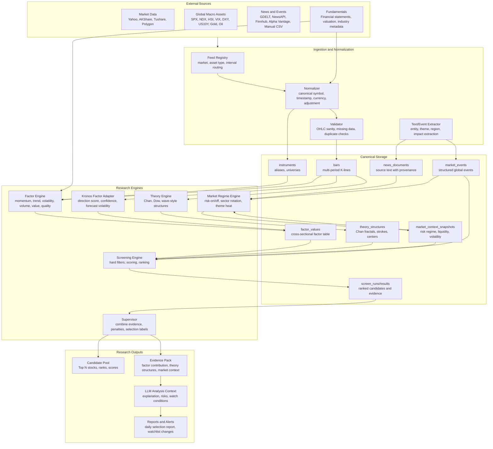

# Global-Aware Stock Selection Architecture

Date: 2026-05-24
Project: OpenStockAgent
Status: Draft for review

## 1. Mission

OpenStockAgent is a global-aware quantitative stock selection research agent.

The goal is not to predict the next price of one stock. The goal is to scan a stock universe, rank candidates, explain why they are selected, and show which market conditions would confirm or invalidate the selection.

The system combines:

- Bottom-up individual stock evidence: price-volume behavior, technical factors, Chan theory structures, fundamentals, and optional Kronos-derived forecast factors.
- Top-down market context: global indices, rates, FX, commodities, volatility, sector rotation, themes, macro releases, and international news.
- LLM explanation: structured summaries based on evidence, not free-form prediction.

## 2. Architecture Diagram



## 3. Layer Responsibilities

### 3.1 Universe Layer

The universe layer defines what can be selected.

Examples:

- A-share all market.
- A-share main board only.
- HK large caps.
- US tech universe.
- User watchlist.
- Theme universe, such as AI, semiconductor, energy, gold, defense.

Core tables:

```text
universes
  universe_id, name, market, asset_type, description, created_at

universe_members
  universe_id, instrument_id, start_date, end_date, reason
```

Selection always runs against a specific universe. This prevents hidden changes in the candidate set.

### 3.2 Canonical Data Layer

This layer follows the existing market data design.

Important rule: canonical K-line data stays factual. It does not store selection scores, Chan labels, sentiment, or LLM commentary.

Core tables inherited from the data-source design:

```text
instruments
instrument_aliases
bars
feed_runs
data_quality_issues
prediction_runs
predicted_bars
```

The previous market data plan becomes Phase 1 of this broader stock selection architecture.

### 3.3 Factor Layer

The factor layer computes cross-sectional values for every stock in a universe.

Factor categories:

```text
momentum     5d, 20d, 60d return, relative strength
trend        moving average stack, MA slope, golden/death cross
volatility   ATR, drawdown, amplitude, volatility compression
volume       turnover, amount expansion, volume-price confirmation
value        PE, PB, EV/EBITDA, dividend yield
quality      ROE, margin, cash flow quality, debt pressure
growth       revenue growth, earnings growth, guidance changes
sentiment    news sentiment, social/news heat, event tone
theme        AI, semiconductor, oil, gold, defense, policy theme exposure
theory       Chan structure score, buy/sell point type, divergence
kronos       direction score, confidence, forecast volatility
```

Core tables:

```text
factor_definitions
  factor_name, category, direction, description, version

factor_values
  instrument_id, trade_date, interval, factor_name,
  factor_value, percentile, zscore, version, evidence_json
```

Factors are evidence, not decisions. The screening engine decides how to combine them.

### 3.4 Theory Engine Layer

Classic theories such as Chan theory are added as structure engines.

Chan theory should be represented as intermediate structures plus signals:

```text
theory_structures
  structure_id, instrument_id, interval, theory_name,
  structure_type, direction, start_timestamp, end_timestamp,
  strength, confidence, evidence_json, version

theory_signals
  signal_id, instrument_id, interval, theory_name,
  signal_type, direction, strength, confidence,
  summary, evidence_json, version
```

Initial Chan structure scope:

- Inclusion handling.
- Top and bottom fractals.
- Basic strokes.
- Simplified centers.
- Basic divergence.
- Early second-buy and second-sell candidates.

The output is not a direct buy order. It is a stock-selection evidence source.

### 3.5 Market Context Layer

This is the top-down layer that captures market direction and international news.

Inputs:

- Global indices: SPX, NDX, DJI, HSI, CSI300, Nikkei.
- Volatility: VIX or local volatility proxies.
- Rates: US10Y, Fed policy expectations, China rates.
- FX: DXY, USDCNH, USDJPY.
- Commodities: gold, oil, copper.
- News and events: geopolitics, tariffs, central banks, inflation, earnings, industry policy.

Core tables:

```text
global_market_bars
  asset_id, timestamp, interval, open, high, low, close, source

market_context_snapshots
  snapshot_id, as_of, region, risk_regime,
  liquidity_score, volatility_score, usd_strength_score,
  commodity_pressure_score, sector_rotation_json, summary_json

news_documents
  document_id, source, source_type, published_at, collected_at,
  title, url, language, region, text_hash, excerpt, raw_payload_json

market_events
  event_id, event_type, region, event_time, title, summary,
  affected_sectors_json, affected_themes_json,
  impact_direction, impact_score, confidence, evidence_refs_json

theme_scores
  trade_date, theme_name, region, heat_score,
  sentiment_score, momentum_score, evidence_refs_json

instrument_theme_exposures
  instrument_id, theme_name, exposure_score, source, updated_at
```

Market context modifies selection scores. It should not directly select a stock by itself.

### 3.6 Screening and Ranking Layer

The screening layer performs two steps.

Hard filters remove invalid candidates:

```text
liquidity too low
ST or suspended
newly listed below configured age
missing recent bars
extreme data quality issues
financial distress filters
blacklist or unsupported market
```

Ranking combines factor evidence:

```text
total_score =
  individual_factor_score
+ theory_structure_score
+ sector_rotation_score
+ theme_alignment_score
+ market_regime_adjustment
+ news_event_adjustment
+ kronos_optional_score
- risk_penalty
```

Core tables:

```text
screen_strategies
  strategy_name, version, config_json, description

screen_runs
  run_id, universe_id, trade_date, strategy_name, version,
  market_context_snapshot_id, status, created_at

screen_results
  run_id, instrument_id, rank, selected, total_score,
  score_breakdown_json, reason_json, risk_json, evidence_refs_json
```

### 3.7 LLM Explanation Layer

The LLM does not pick stocks directly. It explains selected candidates and risk conditions using structured evidence.

LLM input:

```text
candidate rank and score
factor contribution
Chan or other theory structures
market context snapshot
related global events and news
data quality notes
confirmation conditions
invalidation conditions
```

LLM output:

```text
why selected
main supporting evidence
main risks
market context influence
what to observe next
what invalidates the setup
```

Every LLM statement must be traceable to `evidence_refs_json`.

## 4. Main Data Flow

### 4.1 Daily Selection Flow

```text
sync universe members
  -> sync bars and fundamentals
  -> sync global market bars
  -> collect news and events
  -> build market context snapshot
  -> compute stock factors
  -> compute theory structures
  -> apply hard filters
  -> rank candidates
  -> build evidence pack
  -> generate LLM explanation
  -> publish daily candidate report
```

### 4.2 Intraday or Event-Driven Flow

```text
new market event or major news
  -> extract affected region, sectors, themes
  -> update market context snapshot
  -> re-score impacted universes
  -> flag watchlist changes
  -> generate short explanation
```

### 4.3 Backtest Flow

```text
load historical universe as of date
  -> load only data available by as_of
  -> compute factors and theory structures
  -> rank candidates
  -> evaluate forward returns and drawdowns
  -> record factor contribution and stability
```

## 5. Kronos Positioning

Kronos is no longer the center of the product. It becomes an optional factor source.

Suggested Kronos factors:

```text
kronos_direction_score_5d
kronos_expected_return_5d
kronos_forecast_volatility_5d
kronos_confidence
```

Kronos can improve ranking when it agrees with other evidence, but it should not override liquidity, data quality, risk regime, or core selection filters.

## 6. Candidate Output Shape

Example candidate result:

```json
{
  "run_id": "screen_20260524_cn_all",
  "instrument_id": "EQUITY:CN:600519",
  "rank": 3,
  "selected": true,
  "total_score": 82.4,
  "score_breakdown": {
    "momentum": 15.2,
    "trend": 13.7,
    "volume": 8.9,
    "chan_theory": 14.1,
    "sector_rotation": 10.3,
    "theme_alignment": 9.8,
    "market_regime": 3.4,
    "news_event": 4.2,
    "risk_penalty": -2.2
  },
  "reasons": [
    "20-day relative strength is in the top market decile.",
    "Volume expansion confirms recent trend recovery.",
    "Daily Chan structure shows an early second-buy candidate.",
    "The stock's theme exposure aligns with current policy and sector rotation."
  ],
  "risks": [
    "Market context is neutral rather than risk-on.",
    "If volume falls below the 20-day average, the setup weakens."
  ],
  "evidence_refs": [
    "factor:EQUITY:CN:600519:2026-05-24:momentum_20d",
    "theory_signal:chan:sig_...",
    "market_context:ctx_...",
    "event:event_..."
  ]
}
```

## 7. Implementation Boundaries

First implementation should include:

- Canonical data layer from the previous market data plan.
- Universe definitions and members.
- A first stock selection run table.
- A small factor engine: momentum, trend, volume, volatility.
- Basic MA golden/death cross signals.
- A minimal theory interface that can return explicit empty structures until Chan logic is implemented.
- Market context snapshot schema with manually loaded or fixture data.
- News/event schema and manual CSV ingestion.
- Candidate ranking and explanation context.

First implementation should not include:

- Fully automated global news ingestion.
- Paid data providers.
- Real-time streaming.
- Full Chan theory implementation.
- Full LLM API generation.
- Trading or order execution.

## 8. Design Principles

1. Selection before prediction. The product optimizes candidate discovery, not price forecasts.
2. Evidence before explanation. LLM output must be grounded in stored factor values, events, structures, and quality notes.
3. Top-down plus bottom-up. Individual stock strength is reweighted by market regime, sector rotation, and international events.
4. Theory as structure, not magic. Chan theory and similar systems produce traceable structures and signals.
5. Anti-lookahead by default. Historical selection must only use data available at the selection time.
6. Replaceable data sources. Feed changes should not change factor, ranking, or explanation code.
