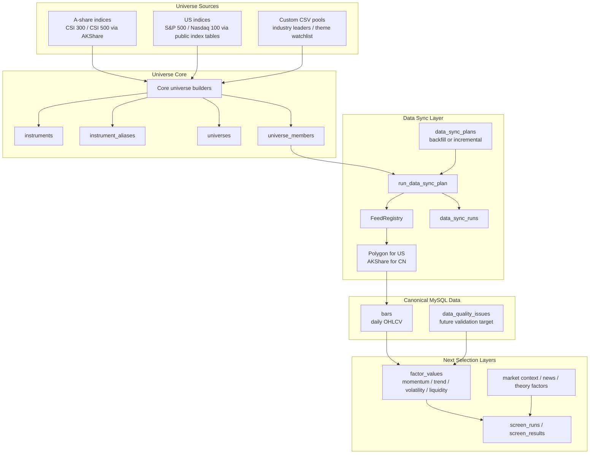

# Core Universe And Daily Bar Sync

Date: 2026-05-25
Project: OpenStockAgent
Status: Implemented MVP

## Goal

This stage builds a usable stock-selection data base before expanding into Hong Kong stocks, crypto, automated news, or advanced theory engines.

Scope:

- A-share core universe: CSI 300, CSI 500, and custom industry leaders.
- US core universe: S&P 500, Nasdaq 100, and custom theme watchlist.
- HK is deferred.
- Each stock keeps 3-5 years of daily bars after backfill.
- Daily operation fetches only the recent 5-10 natural days and upserts them to repair gaps.

This is not a full-market crawler. It is a controlled candidate universe for stock selection.

## Architecture



## Data Sources

### A-share

Universe membership:

- CSI 300: AKShare `index_stock_cons_csindex(symbol="000300")`.
- CSI 500: AKShare `index_stock_cons_csindex(symbol="000905")`.
- Custom industry leaders: `resources/universes/cn_industry_leaders.csv`.

Daily bars:

- AKShare A-share daily historical bars.
- Source symbol format: six-digit A-share code, such as `600519`.

### US stocks

Universe membership:

- S&P 500: public index constituent table.
- Nasdaq 100: public index constituent table.
- Custom theme watchlist: `resources/universes/us_theme_watchlist.csv`.

Daily bars:

- Polygon aggregate bars.
- Source symbol format: US ticker, such as `AAPL`.

Polygon is the production-oriented default for US data. Yahoo-compatible feeds remain useful for experiments, but the operational sync path uses Polygon.

## Storage Contract

The core tables used in this stage are:

```text
instruments
instrument_aliases
universes
universe_members
bars
data_sync_plans
data_sync_runs
```

Important conventions:

- `instrument_id` is canonical: `EQUITY:CN:600519`, `EQUITY:US:AAPL`.
- External source symbols live in `instrument_aliases`.
- `bars` is factual OHLCV storage only.
- Ranking, sentiment, theory labels, and LLM text do not go into `bars`; they become factors or evidence later.

## Fetch Amount

The system intentionally avoids full-market and full-history crawling at this stage.

Initial backfill:

- Target universe only.
- 3 years by default.
- 5 years supported through `--lookback-years 5`.
- Daily bars only.

Daily incremental:

- Target universe only.
- 10 natural days by default.
- 5 days is acceptable for stable production runs.
- Uses upsert semantics, so the recent window repairs missing or revised bars.
- Retries transient upstream disconnects per symbol before recording an error.

Operational recommendation:

```text
Week 1:
  Build CN and US core universes.
  Backfill 3 years.
  Run factor and screening MVP.

After stable:
  Extend selected universes to 5 years.
  Add scheduled daily incremental sync.
  Add gap quality checks and targeted repair jobs.
```

## Commands

Build the core universes:

```bash
uv run stock-universe build-core --market CN --as-of 2026-05-25
uv run stock-universe build-core --market US --as-of 2026-05-25
```

Run initial backfill:

```bash
uv run stock-data sync --universe cn_core --market CN --as-of 2026-05-25 --mode backfill --lookback-years 3
uv run stock-data sync --universe us_core --market US --as-of 2026-05-25 --mode backfill --lookback-years 3
```

Run daily incremental repair:

```bash
uv run stock-data sync --universe cn_core --market CN --as-of 2026-05-25 --mode incremental --incremental-days 10
uv run stock-data sync --universe us_core --market US --as-of 2026-05-25 --mode incremental --incremental-days 10
```

Limit symbols for smoke tests or batch slicing:

```bash
uv run stock-data sync --universe us_core --market US --as-of 2026-05-25 --mode incremental --max-symbols 5
```

Tune retry behavior for unstable upstream connections:

```bash
uv run stock-data sync --universe cn_core --market CN --as-of 2026-05-25 --mode incremental --max-attempts 5 --retry-sleep-seconds 1
```

If AKShare or EastMoney is interrupted by a local proxy, run the CN sync with direct routing:

```bash
NO_PROXY='*' no_proxy='*' uv run stock-data sync --universe cn_core --market CN --as-of 2026-05-25 --mode incremental --incremental-days 10
```

## Current Limitations

- HK stocks are not included in this stage.
- A-share universe and bars depend on AKShare upstream availability.
- US universe membership currently uses public index tables; a later production hardening step can replace this with a licensed constituent source.
- Data quality issue generation is not yet wired into the sync runner.
- Factors and screening consume the canonical bars in later steps; this stage focuses on making the universe and bar data available in MySQL.
