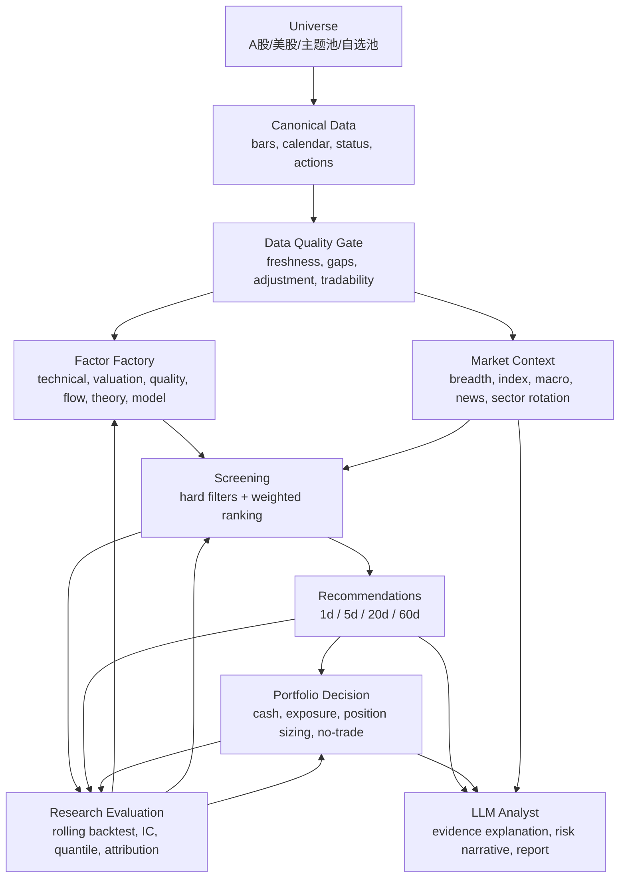

# 专业级量化股票研投 Agent 架构复盘与演进规划

日期：2026-05-28
项目：OpenStockAgent
状态：基于现有代码与本地数据状态的架构复盘和下一阶段规划
依据：当前代码 `991f48d`，已有 specs，核心源码，及本地 MySQL 只读检查结果

## 1. 总结结论

当前方向是对的，而且已经不再是单纯的 Kronos 预测工具。现在系统已经形成了一条真实的股票选股研究链路：

```text
股票池
-> 数据同步
-> 标准行情 bars
-> 因子 factor_values
-> 市场现实 calendar/status/actions
-> 筛选排名 screen_runs/results
-> 分周期推荐 recommendation_runs/items
-> 仓位决策 portfolio_decisions/target_allocations
-> 研究复盘 backtest_runs/results
```

这条链路是专业级量化股票研投 Agent 的正确骨架。最重要的一点已经做对了：系统没有让模型直接决定买什么，而是先建立数据、因子、排名、证据、推荐周期、仓位约束和复盘记录。

但它现在还不能算专业级，只能算“专业级架构的可运行雏形”。真正的缺口不是再加一个 LLM，也不是马上继续堆新闻源，而是要把研究闭环做实：

```text
point-in-time 历史数据
-> 滚动生成候选
-> 前瞻收益评估
-> 因子有效性诊断
-> 策略版本对比
-> 组合风险模拟
-> 生产数据质量闸门
```

下一阶段核心目标应该是：

> 把当前“能跑今日推荐”的系统，升级成“能证明自己为什么有效、什么时候失效、该如何调参”的量化研投系统。

## 2. 当前已经有什么

### 2.1 数据源层

相关代码：

- `src/openstockagent/data/feeds/base.py`
- `src/openstockagent/data/feeds/registry.py`
- `src/openstockagent/data/feeds/tushare.py`
- `src/openstockagent/data/feeds/polygon.py`
- `src/openstockagent/data/feeds/akshare.py`
- `src/openstockagent/data/feeds/yahoo.py`
- `src/openstockagent/data/feeds/csv_feed.py`

当前定位：

| 市场 | 当前方向 | 代码状态 |
| --- | --- | --- |
| A 股 | Tushare 做生产主数据源 | 已有 `TushareClient`、`TushareAStockFeed`、`TushareReferenceFeed` |
| 美股 | Polygon 做生产级行情源 | 已有 `PolygonStockFeed` |
| A 股 fallback | AKShare | 已有 |
| 实验/原型 | Yahoo/yfinance | 已有 |
| 测试 | CSV | 已有 |

判断：A 股用 Tushare 做主数据底座是正确方向。代码里已经不只是接了日 K，还接了 `stock_basic`、`trade_cal`、`daily`、`daily_basic`、`stock_st`、`suspend_d`、`stk_limit`、`adj_factor`，这说明 A 股生产底座已经开始成形。

### 2.2 标准化行情层

核心代码：`src/openstockagent/data/storage.py`

已实现 MySQL 表：

- `instruments`
- `instrument_aliases`
- `bars`
- `feed_runs`
- `data_quality_issues`
- `prediction_runs`
- `predicted_bars`
- `technical_features`
- `technical_signals`

正确点：

- `instrument_id` 统一，比如 `EQUITY:CN:600519`。
- 外部源代码放在 `instrument_aliases`，没有污染业务逻辑。
- `bars` 只存事实行情，不存因子、情绪、LLM 文本或策略结论。
- 预测、技术信号和行情分表存储。
- `load_bars` 支持按 `source` 和 `adjustment` 过滤，避免 raw 和 adjusted 数据混用。

当前风险：

- `bars.bar_timestamp` 仍是 `VARCHAR(64)`，长期建议改为真实 UTC `DATETIME/TIMESTAMP`，同时保留交易所本地日期。
- `TushareDailyBatch` 当前写入 `raw` bars，而 `run_stored_bar_factor_pipeline` 默认读取 `split_adjusted`。这在数据纯度上是对的，但运营上意味着每日 raw 增量不会自动进入默认技术因子计算。
- `data_quality_issues` 表已存在，但同步 runner 还没有系统性写入质量问题。

### 2.3 股票池层

相关代码：

- `src/openstockagent/universe/core.py`
- `src/openstockagent/universe/storage.py`
- `src/openstockagent/universe/builders.py`

已实现：

- A 股核心池：沪深 300、中证 500、自定义行业龙头。
- 美股核心池：S&P 500、Nasdaq 100、自选主题池。
- MySQL 表：`universes`、`universe_members`。

判断：把 universe 做成一等公民是非常正确的。专业选股系统不能隐式扫一堆不稳定 ticker，每次选股必须知道自己面对的是哪个股票池。

当前短板：

- `universe_members` 有 `start_date/end_date`，但上游构建还偏“当前成分 + 自定义列表”。严格回测需要历史成分股、退市股和 IPO 日期，否则会有幸存者偏差。

### 2.4 市场现实层

相关代码：

- `src/openstockagent/market/models.py`
- `src/openstockagent/market/storage.py`
- `src/openstockagent/market/calendar.py`
- `src/openstockagent/pipelines/tushare_reference.py`

已实现表：

- `trading_calendar`
- `instrument_status`
- `corporate_actions`
- `market_context_snapshots`

已接入的 A 股现实数据：

- Tushare `trade_cal` -> 交易日历
- Tushare `stock_st` -> ST 状态
- Tushare `suspend_d` -> 停牌状态
- Tushare `stk_limit` -> 涨跌停价格
- Tushare `adj_factor` -> 复权因子记录

判断：这一层很关键，说明系统已经开始考虑“能不能交易”，而不是只看分数。ST、停牌、涨跌停这些如果不处理，A 股推荐结果会很虚。

当前短板：

- 交易日历还没有成为每日任务是否运行的唯一调度依据。
- 系统仍可能在 Tushare 当日数据未发布前被手动运行。
- corporate actions 已存，但复权因子还没有完整闭环到每日 adjusted bars。

### 2.5 因子层

相关代码：

- `src/openstockagent/factors/technical.py`
- `src/openstockagent/factors/definitions.py`
- `src/openstockagent/factors/cross_section.py`
- `src/openstockagent/factors/engine.py`
- `src/openstockagent/factors/storage.py`
- `src/openstockagent/pipelines/real_data_factors.py`
- `src/openstockagent/pipelines/tushare_daily_batch.py`

已有因子：

- 动量：`return_5d`、`return_20d`、`return_60d`
- 趋势：`ma_trend_score`、`ma_slope_20d`
- 成交量：`volume_expansion_20d`、`volume_ratio`
- 波动/风险：`atr_14d`、`max_drawdown_20d`
- 流动性：`turnover_amount_20d`、`turnover_rate`、`turnover_rate_f`
- 估值：`pe_ttm`、`pb`、`ps_ttm`、`dv_ttm`
- 市值：`total_mv`、`circ_mv`

表结构正确：

```text
factor_definitions
factor_values
```

每个因子值都有：

- `trade_date`
- `interval`
- `factor_name`
- `factor_value`
- `percentile`
- `zscore`
- `version`
- `evidence_json`

判断：这为解释、复盘、因子诊断打好了基础。

当前短板：

- 基本面还主要停在 daily_basic 估值和流动性，没有财报质量、成长、现金流、负债等因子。
- 没有因子 IC、RankIC、分层收益、衰减曲线和因子相关性分析。
- 缠论、Kronos、市场情绪目前在评分配置里有占位，但还不是完整的 factor producer。

### 2.6 筛选排名层

相关代码：

- `src/openstockagent/screening/filters.py`
- `src/openstockagent/screening/scoring.py`
- `src/openstockagent/screening/runner.py`
- `src/openstockagent/screening/storage.py`

已实现 hard filters：

- 最低成交额
- 最低 bar 数
- 最低因子数量
- 排除停牌
- 排除 ST
- 排除涨停
- 排除跌停
- 排除未完成最新 K 线
- 排除严重数据质量问题

当前默认权重：

```text
momentum_score       20%
trend_score          20%
volume_score         10%
volatility_score     10%
liquidity_score      10%
valuation_score      10%
size_score            5%
theory_score          5%
market_context_score  5%
kronos_score          5%
```

判断：这是合理的 MVP 选股模型。缺失的理论、市场上下文、Kronos 先给中性分，不阻断主链路，这样系统可以渐进式演进。

当前短板：

- `mvp_factor_rank/v1` 权重仍是人工设定，没有用历史研究结果校准。
- A 股和美股没有拆出不同策略版本。
- 没有行业中性、主题暴露控制、风格暴露控制。

### 2.7 市场环境层

相关代码：

- `src/openstockagent/market/regime.py`
- `src/openstockagent/market/storage.py`

当前 `market_context_snapshots` 来自内部股票池广度：

- 20d/60d 正收益占比
- MA 趋势占比
- ATR/回撤状态
- 流动性状态

风险状态：

- `risk_on`
- `neutral`
- `risk_off`
- `high_risk`
- `data_bad`
- `unknown`

判断：这一层已经能影响推荐和仓位，是正确的。`run_cn_daily_selection_pipeline` 可以自动生成市场状态，推荐层会在 `data_bad/high_risk` 时降级，组合层会按市场状态控制仓位。

当前短板：

- 这还不是完整 top-down market context，只是股票池内部广度。
- 国际新闻、全球指数、VIX、美元、利率、商品、行业轮动都还没有接入。

### 2.8 推荐层

相关代码：

- `src/openstockagent/recommendations/models.py`
- `src/openstockagent/recommendations/runner.py`
- `src/openstockagent/recommendations/storage.py`

已实现：

- 周期：`1d`、`5d`、`20d`、`60d`
- 不同周期有不同推荐 preset
- 动作：`buy_candidate`、`watch`、`skip`
- 推荐到期复盘日
- `thesis_json`
- `confirmation_json`
- `invalidation_json`
- `risk_json`
- `evidence_refs_json`
- 到期 review pipeline

判断：筛选结果和推荐结果已经分层，这是对的。推荐不是“Top 10 就买”，而是带周期、预期、风险和失效条件。

当前短板：

- `expected_return` 和 `expected_risk` 还是基于分数的启发式估计，不是历史统计校准。
- review 逻辑有了，但还没有形成完整滚动研究评估体系。

### 2.9 组合/仓位层

相关代码：

- `src/openstockagent/portfolio/models.py`
- `src/openstockagent/portfolio/decision.py`
- `src/openstockagent/portfolio/storage.py`

当前市场状态仓位上限：

```text
risk_on   -> 85%
neutral   -> 50%
risk_off  -> 20%
high_risk -> 0%
data_bad  -> 0%
unknown   -> 30%
```

已支持：

- 总仓位上限
- 单票最大仓位
- 最大持仓数
- 现金底线
- 每日最大新增数量
- 最低推荐置信度
- 可选 watch allocation

判断：这已经避免了“永远推荐、永远满仓”的危险，是专业研投 Agent 必须有的层。

当前短板：

- 当前持仓表存在，但 `build_portfolio_decision` 还没有读取现有持仓做调仓。
- 没有行业/主题暴露上限。
- 没有成交额容量约束。
- 没有 reduce/sell/hold/rebalance 逻辑。
- 没有根据复盘结果调整仓位规则。

### 2.10 研究复盘层

相关代码：

- `src/openstockagent/research/models.py`
- `src/openstockagent/research/evaluation.py`
- `src/openstockagent/research/storage.py`
- `src/openstockagent/cli/stock_research.py`

已实现：

`stock-research evaluate-screen` 可以对某次 `screen_run_id` 做未来收益复盘：

- forward return
- benchmark return
- excess return
- max drawdown
- max favorable return
- hit
- summary JSON

判断：这是从“会推荐”走向“会证明”的第一步，非常关键。

当前短板：

- 只能评估一次已有 screen run。
- 还不能自动生成历史滚动 screen run。
- 还没有因子 IC、分层收益、策略版本对比。
- 本地 MySQL 检查显示 `backtest_runs/backtest_results` 还没创建，因为新增 research CLI 后还没实际跑过建表逻辑。

## 3. 本地数据状态

2026-05-28 本地 MySQL 只读检查结果：

| 表 | 当前状态 |
| --- | ---: |
| `instruments` | 6040 |
| `bars` | 590249 |
| `universes` | 4 |
| `universe_members` | 2120 |
| `factor_values` | 14481 |
| `screen_runs` | 6 |
| `screen_results` | 1652 |
| `recommendation_runs` | 4 |
| `recommendation_items` | 42 |
| `recommendation_reviews` | 1 |
| `portfolio_decisions` | 5 |
| `target_allocations` | 16 |
| `market_context_snapshots` | 3 |
| `trading_calendar` | 9 |
| `instrument_status` | 15252 |
| `corporate_actions` | 11048 |
| `backtest_runs` | missing |
| `backtest_results` | missing |

行情日期范围：

```text
2023-04-06 .. 2026-05-27
590249 rows
```

最新因子日期：

```text
2026-05-28
7200 factor rows
```

最近筛选记录：

```text
screen-cn-core-20260528-sina50  cn_core  2026-05-28  completed
screen-92387d89d9d07f33         cn_core  2026-05-28  completed
screen-ce51b9a266f3b376         cn_core  2026-05-27  completed
```

解释：

- A 股 MVP 研究数据已经够用。
- 2026-05-28 的推荐本质上是基于上一交易日收盘或已有历史数据的盘前推荐，不是盘中实时推荐。
- Research 表需要通过新 CLI 或显式 init 命令创建。

## 4. 目标专业级架构

目标架构应该是一个可审计、可复盘、可控仓位的研投闭环：



专业级系统每天必须回答六个问题：

1. 数据今天是否足够新、足够可信？
2. 本次选股用的是哪个股票池，是否 point-in-time 正确？
3. 哪些因子在这个市场和周期上历史有效？
4. 今天哪些股票排名高，证据是什么？
5. 组合今天应该加仓、减仓、观察，还是空仓？
6. 到期后这次推荐是否有效，哪些因子贡献或误导？

## 5. 关键差距

### 5.1 数据可靠性差距

当前数据结构很好，但运营可靠性还不够。

代码层面的具体问题：

- `run_tushare_daily_batch_sync` 中 `_filter_source_symbols` 遇到空 DataFrame 会返回没有列的空表，后续访问 `matched_daily["ts_code"]` 可能触发 `KeyError`。
- 每日 Tushare batch 写 `raw`，默认技术因子读 `split_adjusted`，每日增量和默认因子计算之间存在 adjustment 策略差异。
- `data_quality_issues` 表存在，但还没有成为 sync runner 的质量记录出口。
- `trading_calendar` 存在，但还没有成为“今天是否该生成推荐”的硬闸门。

专业要求：

```text
数据不 ready，就不应该生成看似新鲜的推荐。
```

如果 Tushare 当日数据还没发布，系统应输出 `market_not_ready` 或 `no_data_yet`，而不是崩溃或误导用户。

### 5.2 Point-in-time 研究差距

当前系统能生成今天的排名，但还不能严谨证明“过去这样选是否有效”。

缺少：

- 滚动历史 screen generation。
- 严格只使用 as_of 当时可见数据。
- 历史股票池成分。
- 对齐基准的超额收益评估。
- 交易成本、滑点、停牌、涨跌停执行假设。
- 策略版本对比。

这是目前离专业级最近也最关键的缺口。

### 5.3 因子研究差距

当前因子够 MVP，但还不能指导权重优化。

缺少：

- RankIC / IC。
- 分位数组合收益。
- 因子衰减：1d、5d、20d、60d。
- 因子相关性和冗余。
- 按市场状态分组的因子表现。
- A 股和美股不同因子权重。

没有这些，因子权重就是经验配置，不是研究结论。

### 5.4 市场动向和国际新闻差距

现在 `market_context_snapshots` 主要来自股票池内部广度，不是真正的全球 top-down context。

缺少：

- 全球指数：SPX、NDX、HSI、Nikkei、CSI300。
- 波动、利率、汇率、商品：VIX、DXY、US10Y、油、金、铜。
- 行业和主题轮动。
- 新闻/事件存储。
- 新闻到主题/行业/个股的映射。
- 给 LLM 使用的 evidence pack。

原则：

```text
新闻和宏观不直接决定买哪只股票。
它们改变市场状态、行业主题分数和解释证据。
```

### 5.5 组合风险差距

组合层已经能控制现金和市场状态仓位，但还是 MVP。

缺少：

- 读取当前持仓做再平衡。
- sell/reduce/hold 决策。
- 行业/主题仓位上限。
- 基于 20 日成交额的容量约束。
- 组合预期回撤预算。
- 推荐复盘驱动的仓位规则更新。

原则：

```text
推荐是研究输出。
仓位是风险预算。
两层必须分开。
```

### 5.6 理论、模型和 LLM 差距

当前配置中已经预留：

- 缠论
- Kronos
- LLM 分析

但它们还不是完整证据生产者。

正确演进方式：

- 缠论输出 `chan_structure_score` 和结构化证据。
- Kronos 输出可选 `kronos_score`，不做主决策器。
- LLM 解释证据，不隐藏式选股。

## 6. 下一步有三种选择

### 方案 A：继续加数据源

内容：继续接更多 Tushare 财务、新闻、宏观、第三方资讯。

优点：

- 证据类别更丰富。
- 看起来更像“全球研投 Agent”。

缺点：

- 没有滚动评估前，更多数据不等于更有效。
- 复杂度会上升，但系统还不知道哪些数据真的有用。

结论：不是最优先。

### 方案 B：先做 LLM 分析报告

内容：基于当前推荐生成自然语言日报。

优点：

- 用户体验提升快。
- 输出更像研究助手。

缺点：

- 如果底层因子和评估不牢，LLM 会把弱信号讲得很有道理。
- 不能解决数据可靠性和因子有效性问题。

结论：可以后做，不应该现在作为主线。

### 方案 C：先做研究评估和数据质量闭环

内容：修日更可靠性，做滚动历史评估，做因子诊断，做策略版本对比。

优点：

- 系统从“会推荐”变成“能证明”。
- 后续调权重有依据。
- 组合仓位更稳。
- LLM 未来会有真实证据可解释。

缺点：

- 不如新闻/LLM 显眼。
- 对 point-in-time 纪律要求高。

结论：推荐方案。下一步就做这个。

## 7. 下一阶段目标

下一阶段目标：

```text
Research Evaluation v2 + Production Data Readiness
```

也就是两条线并行推进：

1. 数据日更要稳定、诚实、可审计。
2. 研究层要能滚动验证策略是否有效。

## 8. Workstream 1：生产数据可用性

目标：让 A 股每日运行稳定，并且不伪造新鲜度。

### 8.1 修 Tushare 空数据

当前问题：

```text
Tushare 当日未发布数据
-> fetch_daily 返回空 DataFrame
-> _filter_source_symbols 返回无列空表
-> 后续访问 ts_code 报错
```

期望行为：

```text
daily_rows_seen=0
instruments_matched=0
bars_written=0
factor_values_written=0
status=no_data_yet 或 market_not_ready
```

涉及文件：

- `src/openstockagent/pipelines/tushare_daily_batch.py`
- `tests/test_tushare_daily_batch.py`

### 8.2 增加 Data Readiness 检查

建议新增对象：

```text
DataReadinessCheck
  universe_id
  as_of
  latest_bar_date
  latest_factor_date
  is_trading_day
  data_status: ready | stale | market_not_ready | data_bad
  issues_json
```

推荐生成前必须检查：

- 目标股票池最新 bar 日期。
- 最新 factor 日期。
- 是否交易日。
- 市场现实数据是否覆盖。
- 数据质量问题是否严重。

涉及文件：

- `src/openstockagent/pipelines/cn_daily_selection.py`
- `src/openstockagent/market/calendar.py`
- `src/openstockagent/data/storage.py`
- `tests/test_cn_daily_selection_pipeline.py`

### 8.3 明确复权策略

当前矛盾：

- 每日 batch 写 `raw`。
- 技术因子默认读 `split_adjusted`。

推荐做法：

```text
回测和技术因子默认使用 split_adjusted。
每日增量也要有 adjusted 更新路径。
raw bars 保留用于审计和必要的真实成交价格解释。
```

短期可以先做：

- 日更阶段如果只有 raw，则明确标记 `stale_adjusted_bars`。
- 推荐层只使用 adjusted 因子。

中期再做：

- 用 Tushare `pro_bar` 或 `adj_factor` 生成每日 adjusted bars。

### 8.4 写入 data_quality_issues

至少记录：

- provider empty response
- latest bar missing
- OHLC 异常
- 重复 K 线
- 极端跳变
- adjustment mismatch
- insufficient coverage

## 9. Workstream 2：滚动研究评估

目标：回答“这套策略过去到底有没有用”。

新增命令建议：

```bash
uv run stock-research rolling-screen \
  --universe cn_core \
  --start-date 2025-01-01 \
  --end-date 2026-05-01 \
  --horizon-days 5 \
  --rebalance weekly \
  --top-n 20 \
  --benchmark-instrument-id EQUITY:CN:000300
```

流程：

```text
for each rebalance date:
  load point-in-time universe
  load bars <= as_of
  compute factor_values at as_of
  run screening strategy version
  evaluate forward returns after horizon
  store per-date result

aggregate:
  mean return
  median return
  hit rate
  mean excess return
  max drawdown
  best/worst result
  skipped count
  turnover approximation
  regime-conditioned metrics
```

建议新增表：

```text
research_experiment_runs
  experiment_id
  universe_id
  start_date
  end_date
  rebalance_frequency
  horizon_days
  top_n
  strategy_name
  strategy_version
  benchmark_instrument_id
  status
  summary_json

research_experiment_days
  experiment_id
  as_of
  screen_run_id
  backtest_run_id
  market_context_snapshot_id
  candidate_count
  evaluated_count
  mean_return
  mean_excess_return
  hit_rate
  summary_json
```

已有的 `backtest_runs/backtest_results` 继续负责单次 screen 的前瞻复盘。新增 experiment 表负责把很多次 screen 串成一次研究实验。

涉及文件：

- `src/openstockagent/research/models.py`
- `src/openstockagent/research/storage.py`
- `src/openstockagent/research/evaluation.py`
- `src/openstockagent/research/rolling.py`
- `src/openstockagent/cli/stock_research.py`
- `tests/test_research_evaluation.py`
- `tests/test_research_cli.py`

## 10. 分阶段路线图

### Phase 0：运营诚实性

周期：1-3 天。

交付：

- Tushare 空数据不崩溃。
- Research 表可以显式初始化。
- 每日 run 能报告 stale / no_data_yet。
- adjustment 策略明确。
- 数据质量问题写入 `data_quality_issues`。

完成标准：

```text
如果今天 Tushare 数据还没发布，系统明确说数据未 ready，不生成伪新鲜推荐。
```

### Phase 1：Rolling Evaluation MVP

周期：3-7 天。

交付：

- `stock-research rolling-screen`
- 按交易日历生成 weekly/monthly rebalance dates。
- 每个日期生成 screen run 和 forward evaluation。
- 输出汇总指标。
- MySQL experiment 表。

完成标准：

```text
给定 3 年 A 股日 K，系统能评估 cn_core Top 10/20 在历史窗口里的胜率、平均收益、超额收益、回撤和 skipped count。
```

### Phase 2：因子诊断

周期：1-2 周。

交付：

- RankIC / IC。
- 分位数组合收益。
- 因子相关性矩阵。
- 因子周期衰减。
- 按市场状态分组的因子表现。

完成标准：

```text
系统能说清楚 5d、20d、60d 周期里哪些因子该加权，哪些因子该降权。
```

### Phase 3：组合研究

周期：1-2 周。

交付：

- 从推荐历史模拟组合。
- 读取当前持仓做 rebalance。
- 行业/主题暴露限制。
- 成交额容量限制。
- 对比空仓控制是否降低回撤。

完成标准：

```text
系统能比较“永远买 Top 10”和“市场状态控制仓位”哪种收益/回撤更优。
```

### Phase 4：市场动向和国际新闻

周期：2-4 周。

交付：

- 全球指数和宏观资产表。
- 行业/主题分类。
- theme exposure 表。
- 先做新闻/事件手动或 CSV 导入。
- 再接自动新闻源。
- market_context_score 由 bottom-up + top-down 共同生成。

完成标准：

```text
系统不仅能说哪些股票分数高，还能解释市场、行业、宏观、新闻背景是否支持这次选择。
```

### Phase 5：缠论、Kronos、LLM 证据层

周期：2-4 周。

交付：

- 缠论结构引擎 MVP。
- `chan_structure_score` 因子。
- Kronos 批量预测转 `kronos_score`。
- LLM evidence pack。
- 研究日报生成。

完成标准：

```text
理论、模型和 LLM 都是证据来源，不接管最终决策。
```

## 11. 具体下一步怎么做

下一步代码主线：

```text
P0: Data readiness hardening
P1: Rolling research evaluation
```

### Step 1：修 Tushare 空数据

改 `_filter_source_symbols` 或下游访问逻辑，让空 provider frame 不触发 `KeyError`。

验收：

- `run_tushare_daily_batch_sync` 遇到空 daily frame 返回正常 result。
- CLI 不崩。
- 测试覆盖空表。

### Step 2：加数据 ready 检查

新增 readiness 检查模型和函数，推荐前先判断：

- 最新行情日期。
- 最新因子日期。
- 交易日状态。
- market reality 覆盖。
- 数据质量问题。

验收：

- 数据 stale 时，pipeline 明确给出状态。
- 可以选择阻断 recommendation/portfolio，或只生成 watch/skip。

### Step 3：显式初始化 Research 表

新增命令：

```bash
uv run stock-research init-db
```

验收：

- 本地库能创建 `backtest_runs/backtest_results`。
- 后续 rolling evaluation 能直接写入。

### Step 4：实现 rolling-screen

复用现有模块：

- `run_stored_bar_factor_pipeline`
- `build_market_context_snapshot`
- `run_screening_pipeline`
- `evaluate_screen_run`

先保持简单：

- 一个 universe。
- 一个 strategy。
- 一个 horizon。
- 一个 benchmark。
- weekly rebalance。

### Step 5：输出研究汇总

CLI 输出至少包含：

```text
experiment_id
dates_seen
screen_runs_created
backtest_runs_created
evaluated_count
mean_return
mean_excess_return
hit_rate
mean_max_drawdown
skipped_count
```

### Step 6：只跑绿灯测试

按你之前的要求，不需要红灯测试，只做实现后的绿灯验证。

测试建议：

- 空 Tushare daily frame 不崩。
- stale bars 能被 readiness 检测。
- rolling evaluation 按日期调用 factor/screen/evaluate。
- experiment summary 聚合正确。
- CLI entrypoint 正常。

## 12. 最终判断

当前架构方向正确，而且比普通选股脚本健康很多，因为它已经把这些层分开了：

- 数据事实
- 因子证据
- 筛选排名
- 分周期推荐
- 仓位决策
- 复盘评估

这正是专业量化研投 Agent 需要的结构。

下一次演进不要优先追求“说得更像分析师”，而要先让系统“研究上站得住”：

```text
每次推荐都可解释。
每个策略版本都可回测。
每个因子权重都能被诊断支持。
每次日更都知道数据是否 ready。
每次组合决策都可以选择不买、少买、空仓。
```

等滚动评估和数据质量闸门做好，再加国际新闻、缠论、Kronos 和 LLM，才不会变成装饰层。它们会成为可度量、可复盘、可解释的证据来源。
